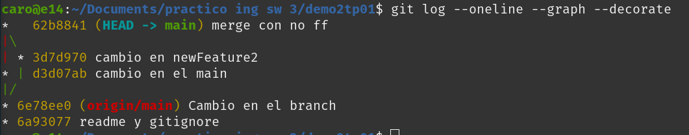

## Trabajo Práctico 1 - Git Básico

- [x] 1- Instalar Git

#### Creación de Repos 01 -> Crearlo en GitHub, clonarlo localmente y subir cambios

Clonar el repositorio remoto en un nuevo directorio local

Editar el archivo Readme.md

Crear y editar el archivo .gitignore
Agregar *.bak

Crear un commit, proveer un mensaje descriptivo y hacer push al repositorio remoto

Realizar otro cambio y subirlo

Configuración de SSH key (muestro llaves existentes)

#### Creación de Repos 02-> Crearlo localmente y subirlo a GitHub
Crear repositorio local y subirlo a GitHub

Agregar archivo Readme.md

Crear archivo .gitignore

Proveer commit y proveer mensaje descriptivo

Crear repositorio en GitHub
El link del repositorio creado es: https://github.com/carohavenstein/demo2tp01
Asociar local con remoto

Error porque el origen que asocié era el HTTP que está deprecado. Cambio el origen a SSH

Subo los cambios con git push

#### Ramas
Veo las ramas, creo nueva rama y me cambio a la nueva rama.

Hago un cambio en la rama, hago commit y veo la diferencia.

#### Merges
Fast-Forward Merge (FF): cuando no ha habido otros cambios en main desde que se creó la rama secundaria.
Hago el merge

Borro la rama y veo el log

No Fast-Forward Merge (No-FF): Este tipo de fusión ocurre cuando se han realizado commits tanto en la rama principal como en la rama secundaria desde que se bifurcaron. Git crea un nuevo commit de fusión que combina los cambios de ambas ramas.
Creo nueva rama

Hago cambio en main

Hago un cambio en la rama

Hago el merge, y veo el resultado

Borro la rama y veo el log

#### Resolución de Conflictos
Creo nueva rama

Hago un cambio en main

En la conflictBranch modificamos la misma línea del Readme.md y commiteamos

Seteo vscode como mi git diff tool

Vemos las diferencias con git difftool main conflictBranch

Me cambio a main e intento un git merge conflictBranch

Resuelvo el conflicto con git mergetool

Haciendo click en “Accept current Change”, elijo y resuelvo el conflicto:

Agrego .orig al .gitignore

Hago commit y push

#### Pull Request
Creo una nueva rama y la pusheo

Me cambio a la pullReqBranch (git checkout pullReqBranch), hago un cambio y lo subo a esa rama

Desde github hago un PullRequest

Aceptar el pull request

Ver opciones de seguridad de la rama

#### Algunos ejercicios online
Entrar a la página https://learngitbranching.js.org/
Completar los ejercicios **Introduction Sequence**